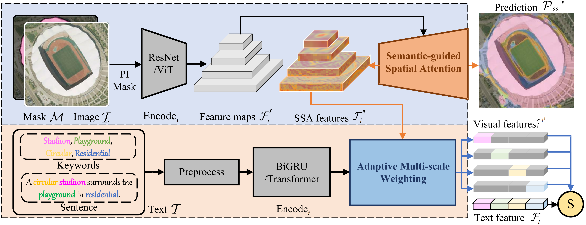
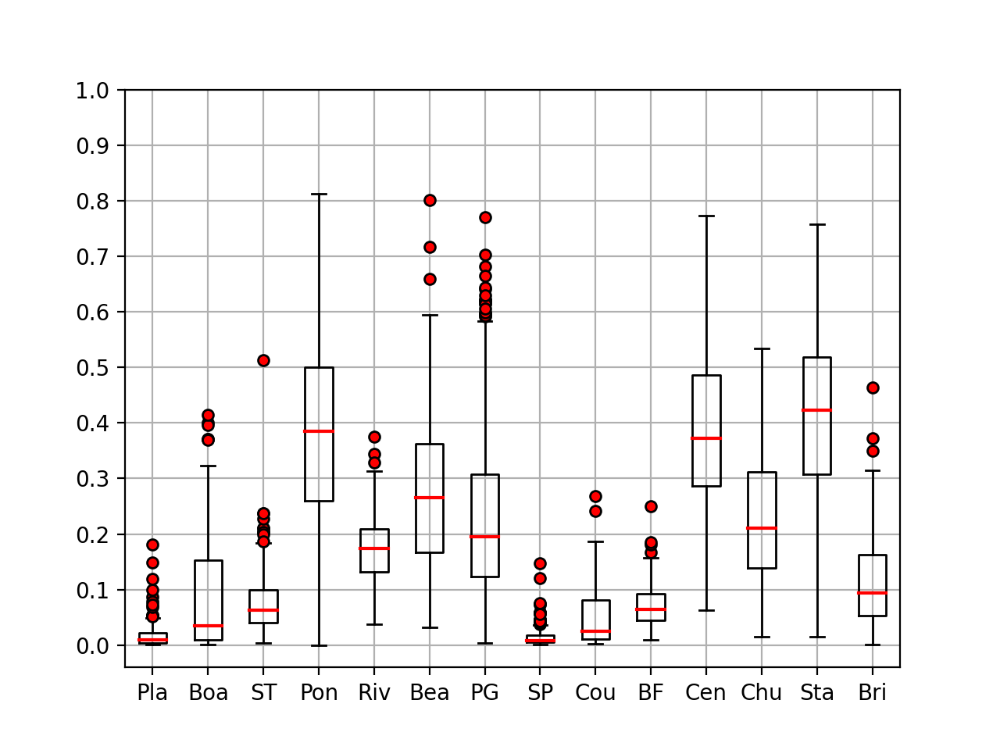
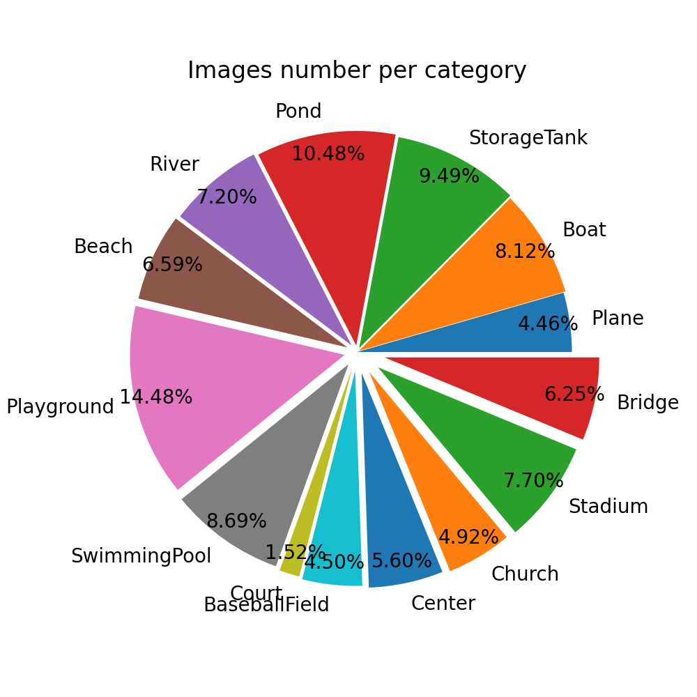
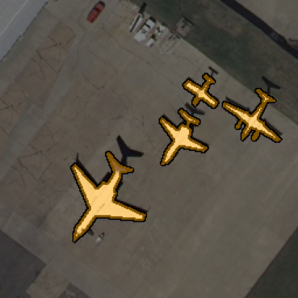
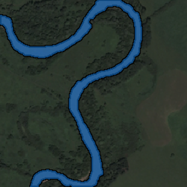

## The offical PyTorch code for paper 
[""SIRS: Multi-task Joint Learning for Remote Sensing Foreground-entity Image-text Retrieval"", TGRS 2024.](https://ieeexplore.ieee.org/document/10533243)

##### Author: Zicong Zhu


<a href="https://pypi.org/project/mitype/"></a>

```bash
#### News:
#### 2024.05.11: SIRS and RSITMD-SS is expected to be released after the paper open to access.
#### 2024.06.22: Dataset label RSITMD-SS is open source!
#### 2024.07.05: code of SIRS is open source!  
```

## INTRODUCTION

We propose a novel Semantic-guided Image-text Retrieval framework with Segmentation (SIRS).

It is a multi-task joint learning framework for plug-and-play and end-to-end training RS CIR models efficiently, including Semantic-guided Spatial Attention (SSA) and Adaptive Multi-scale Weighting (AMW) modules.

##
## SIRS
### Network Architecture

<div align="center">
  
</div>

The SIRS architecture takes images, masks, and text as input. 
Segmentation and similarity results are derived after passing through SSA and AMW, which are both plug-and-play.

##
SSA consists of two parts, namely the BR branch and the SS branch.
The former is to perceive background noise, while the latter learns foreground categories.

##
The module structure of AMW.
It is based on the ideas of feature pyramid and intermediate supervision and performs many-to-many similarity calculations with text features.

### Installation

```shell
Python 3
PyTorch > 0.3
Numpy
h5py
nltk
yaml
```

### training 

simply run

```python
python train.py --path_opt ${your_config.yaml}
```

You can find several samples in ./option directory.

### testing

```python
python test.py --path_opt ${your_config.yaml}
```

Remember to refine the weights_path in test.py.

### inference

We provide some useful tools to infer the input:

```python
# calculate the average of k-folds results
cal_k_average.py 

# compare IR preds with GTs
compare_PredGT.py

# infer query results and segmentation results
infer.py

# infer single query
infer_single.py
```

##
## RSITMD-SS
### Dataset Features

<div align="center">
  
  
</div>


### Segment visualization

we provide a script for visualizing segmentations:

```python
python ./script/merge_imgmsk.py
```

modify it to visualize the samples you want!

```python
## for all 
tmp = ''
idx = 0
image_list = os.listdir(image_dir)
mask_list = os.listdir(mask_dir)
image_list.sort()
mask_list.sort()
for iname, mname in zip(image_list, mask_list):
    if iname.split('_')[0] != tmp:
        tmp = iname.split('_')[0]
        idx = 0
    else:
        idx += 1
    if idx >= 3:
        continue
    print(iname)
    image_path = os.path.join(image_dir, iname)
    mask_path = os.path.join(mask_dir, mname)
    save_path = os.path.join(save_dir, iname.replace('tif', 'png'))
    show_merged(image_path, mask_path, mask_color_dict, save=save_path)

print('DONE!')
```

the results can be shown as:

<div align="center">
  
  
</div>

### Download

[baidu disk: 1ch0](https://pan.baidu.com/s/1jJbmOQbdXks7u9e9Nz3QZQ)

## Citation
If you feel this code helpful or use this code or dataset, please cite it as
```

@ARTICLE{9437331,
  author={Yuan, Zhiqiang and Zhang, Wenkai and Fu, Kun and Li, Xuan and Deng, Chubo and Wang, Hongqi and Sun, Xian},
  journal={IEEE Transactions on Geoscience and Remote Sensing}, 
  title={Exploring a Fine-Grained Multiscale Method for Cross-Modal Remote Sensing Image Retrieval}, 
  year={2022},
  volume={60},
  number={},
  pages={1-19},
  keywords={Task analysis;Image retrieval;Feature extraction;Visualization;Remote sensing;Neural networks;Sun;Asymmetric multimodal feature matching network (AMFMN);cross-modal remote sensing (RS) text–image retrieval;deep features similarity;Remote Sensing Image-Text Match dataset (RSITMD);triplet loss of adaptive margin},
  doi={10.1109/TGRS.2021.3078451}}

@ARTICLE{10533243,
  author={Zhu, Zicong and Kang, Jian and Diao, Wenhui and Feng, Yingchao and Li, Junxi and Ni, Jingen},
  journal={IEEE Transactions on Geoscience and Remote Sensing}, 
  title={SIRS: Multitask Joint Learning for Remote Sensing Foreground-Entity Image–Text Retrieval}, 
  year={2024},
  volume={62},
  number={},
  pages={1-15},
  keywords={Task analysis;Visualization;Semantics;Semantic segmentation;Multitasking;Adaptation models;Remote sensing;Cross-modal image-text retrieval (CIR);feature misalignment;foreground-entity granularity;multitask learning;remote sensing (RS);semantic segmentation (SS)},
  doi={10.1109/TGRS.2024.3402216}}

```
